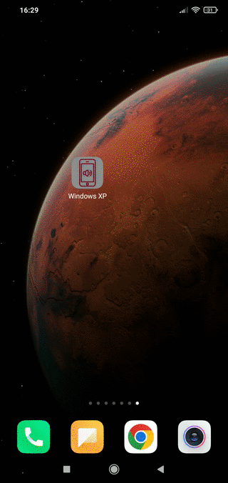

<a name="readme-top"></a>

<div align="center">
  <a href="https://github.com/jkowiesk/SoundboardGenerator">
    
  </a>

  <h3 align="center">SoundboardGenerator</h3>

  <p align="center">
    Capacitor react app, which generates customized android soundboard project ready to build
    <br />
    <a href="example.apk" download>Download example apk</a>
    ·
    <a href="https://github.com/jkowiesk/SoundboardGenerator/issues">Report Bug</a>

  </p>
</div>

### About The Project

<p align="center">
  
</p>

Customizable soundboard built with react, with very user friendly and simple to use UI. All data is stored locally, so there is no need for internet connection. After customization using Capacitor, which converts builded react app to android project.

### Built With

- [![React][react.js]][react-url]
- [![Capacitor][capacitor]][capacitor-url]
- [![MUI][mui]][mui-url]

<p align="right">(<a href="#readme-top">back to top</a>)</p>

## Getting started

### Required

- node
- npm
- android studio
- bash

### Installation

2. Clone the repo
   ```sh
   git clone https://github.com/jkowiesk/SoundboardGenerator.git
   ```
3. Install NPM packages
   ```sh
   npm install
   ```
4. Copy your sounds to _/public/sounds_ folder.
5. Overwrite _/public/images/sound.png_ with PNG picture, which be displayed on sound buttons.
6. Run bash script to initialize app
7. ```sh
    bash androidBuild.sh
   ```
   When everything finishes android studio should open.
8. In android studio, wait for all things to load up. Then make project by clicking **Build>Make Project**.
9. To generate APK file you can choose which option you prefer e.g. **Build>Build Bundle(s) / APK(s)>Build APK(s)**

<p align="right">(<a href="#readme-top">back to top</a>)</p>

## License

Distributed under the MIT License. See `LICENSE.txt` for more information.

<p align="right">(<a href="#readme-top">back to top</a>)</p>
<!-- MARKDOWN LINKS & IMAGES -->

[react.js]: https://img.shields.io/badge/React-20232A?style=for-the-badge&logo=react&logoColor=61DAFB
[react-url]: https://reactjs.org/
[capacitor]: https://img.shields.io/badge/Capacitor-119EFF?style=for-the-badge&logo=Capacitor&logoColor=white
[capacitor-url]: https://capacitorjs.com/
[mui]: https://img.shields.io/badge/Material%20UI-007FFF?style=for-the-badge&logo=mui&logoColor=white
[mui-url]: https://mui.com/
